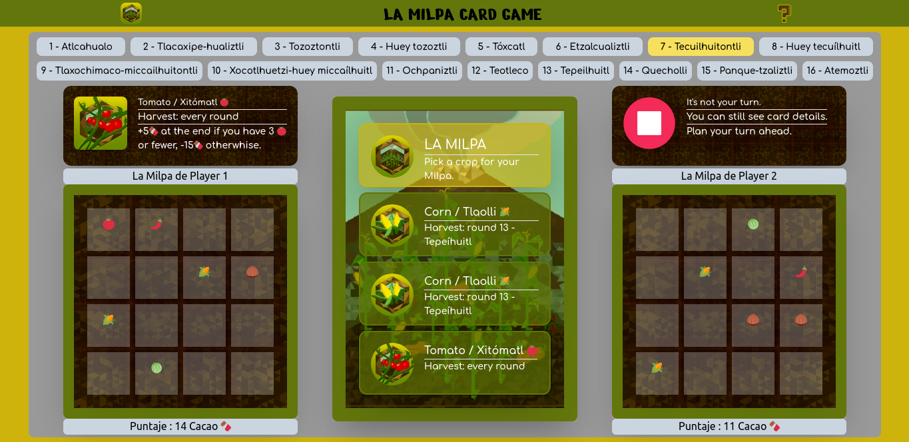
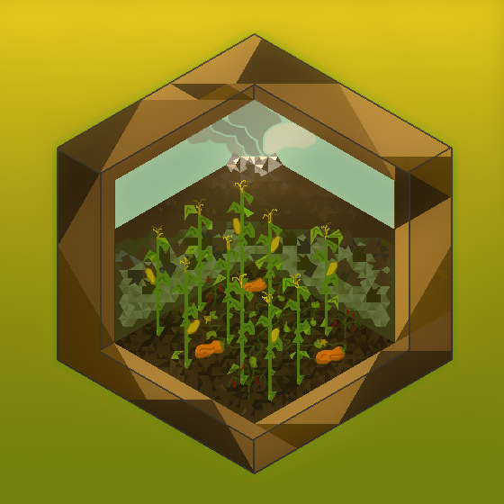

# 

# La Milpa Card Game 
React App making use of Recoil and TailwindCSS. 
<table>
<tr>
<td>
  La Milpa Card Game is a 2 player game that consists of 16 rounds in which Crops from a 50 card deck will be planted at 2 Milpa boards. The player with more Cacao at the end of the 16th round will win.
</td>
</tr>
</table>

## Demo
Here is a working live demo :  https://la-milpa-card-game.vercel.app/

## Original Idea
The idea of La Milpa comes from my love for boardgames and plants, and I found this to be a great opportunity for displaying the vast knowledge and heritage comming from mesoamerican people regarding agriculture. La Milpa was the preferred way of agriculture between mesoamerican people and it consisted in simultanously growning various types of crops in the same land (usually corn, pumpkin, chilli, beans, tomatillo and tomato), all of which had a good and complementary relationship between them, for example beans helped corn not only making the soil absorb more nitrogen but also they will make for complete proteins when consumed together.

La Milpa is intended to be a Full Stack Application with online multiplayer features, but in this first project only the Frontend has been implemented and only local multiplayer is supported.

## Pixel Art
I also used this project to display my love for pixel art, a skill that I enjoy a lot enhancing every time that I see fit. Marmoset Hexels 3 was used for pixel art.
# 

## Usage
* Once repo is cloned
* `yarn install`
* `yarn rurn start`

## License
MIT © [Rolando Sotelo](https://github.com/soteloalarco)
